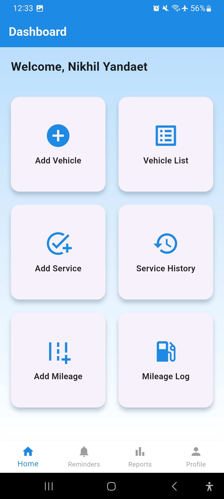
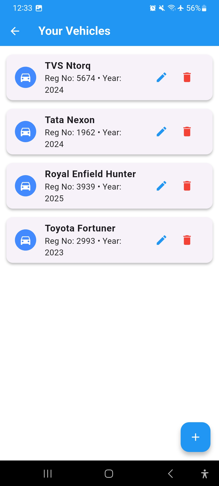
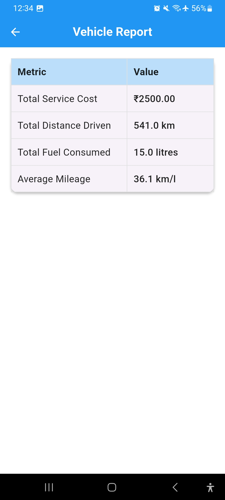
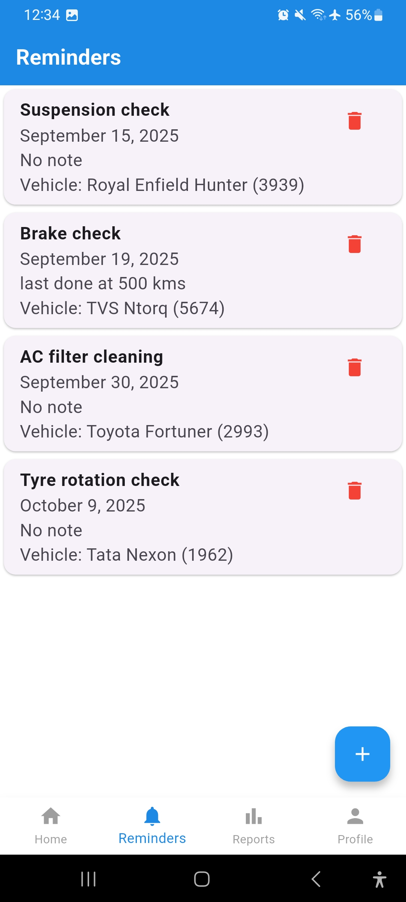

# 🚗 AutoCare+

  
  


**AutoCare+** is a Flutter-based mobile application designed for **vehicle users and garage owners** to manage vehicles, service history, mileage logs, reports and reminders — all in one place.

---

## ✨ Features

* 👤 **User Authentication**

    * Register, login, and persistent login with SQLite + SharedPreferences.
    * Secure logout functionality.

* 📋 **Vehicle Management**

    * Add, edit, delete and view vehicles.
    * Store details like brand, model, registration number, and year.

* 🛠 **Service Records**

    * Add service history for each vehicle.
    * View complete service history anytime.

* ⛽ **Mileage Tracking**

    * Log fuel entries with distance and fuel.
    * Calculate mileage efficiency (km/l).

* 📊 **Reports**

    * Get summarized reports:

        * Total Service Cost
        * Total Distance Driven
        * Total Fuel Consumed
        * Average Mileage (km/l)

* ⏰ **Reminders**

    * Add reminders for service/maintenance.
    * Associate reminders with vehicles.

* 🎨 **Modern UI/UX**

    * Consistent design across screens.
    * Gradient dashboard with grid features.
    * Themed form fields, cards, and dialogs.
    * Bottom navigation bar for quick access.

---

## 🖼️ Screenshots

| Dashboard | Vehicle List | Reports | Reminders |
|-----------|--------------|---------|-----------|
|  |  |  |  |

---

## 🛠 Tech Stack

* **Frontend:** Flutter (Dart)
* **Database:** SQLite (via sqflite)
* **Storage:** SharedPreferences (for login state)
* **IDE:** Android Studio 

---

## 🚀 Getting Started

### Prerequisites

* Install [Flutter SDK](https://flutter.dev/docs/get-started/install)
* Install [Android Studio](https://developer.android.com/studio) or VS Code with Flutter plugin
* Android Emulator / Real Device

### Steps

```bash
# Clone repository
git clone https://github.com/Nikhil-8405/autocare_plus.git

# Navigate into project folder
cd autocare_plus

# Get dependencies
flutter pub get

# Run app
flutter run
```

---

## 👨‍💻 Author

Developed by **\[Nikhil Yandaet]**

---
